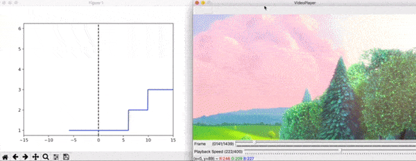

# matplotvideo - syncing video and matplotlib

[](https://pypi.org/project/matplotvideo/)
[](https://pysport.org)
--------
## What is it?

**matplotvideo** is a Python package providing an easy way to sync matplotlib plots to video. 
Some of the features:
- Frame-accurate seeking forward and backward
- Playback speed control between 0.01x and 4x
- Auto frame-skip to maintain playback speed when plot takes to long 
- Seek with slider through entire video
- Intuitive pause/play toggle using spacebar
- Play all `cv2` supported media types

## Where to get it
The source code is currently hosted on GitHub at:
https://github.com/PySport/matplotvideo

Installers for the latest released version are available at the [Python
package index](https://pypi.org/project/matplotvideo).

```sh
# or PyPI
pip install matplotvideo
```

The package requires `cv2` to be installed. When you don't have it installed yet, you can check out [opencv-python](https://pypi.org/project/opencv-python/).

## Video player controls:


*Sync between Scene Change data plot and video*
 
- **'a'** 1 frame back
- **'d'** 1 frame forward
- **space** toggle paused / play
- **esc** quit video player
- **playback speed** can be changed with the slider
- **playback position** can be changed with the slider

## Application examples
- Verify data using video
- Enrich video with additional data, like computer vision model output
- Find interesting video/data frames

## Usage
Import `attach_video_player_to_figure` and attach to matplotlib figure. You can pass additional keyword arguments to `attach_video_player_to_figure` that are passed to the `on_frame` callback on each invocation. 

```python
from matplotvideo import attach_video_player_to_figure
import matplotlib.pyplot as plt

# (timestamp, value) pairs

# sample: big bunny scene cuts
fancy_data = [
    (0, 1),
    (11.875, 1),
    (11.917, 2),
    (15.75, 2),
    (15.792, 3),
    (23.042, 3),
    (23.083, 4),
    (47.708, 4),
    (47.75, 5),
    (56.083, 5),
    (56.125, 6),
    (60, 6)
]


def on_frame(video_timestamp, line):
    timestamps, y = zip(*fancy_data)
    x = [timestamp - video_timestamp for timestamp in timestamps]

    line.set_data(x, y)
    line.axes.relim()
    line.axes.autoscale_view()
    line.axes.figure.canvas.draw()


def main():
    fig, ax = plt.subplots()
    plt.xlim(-15, 15)
    plt.axvline(x=0, color='k', linestyle='--')

    line, = ax.plot([], [], color='blue')

    attach_video_player_to_figure(fig, "BigBuckBunny.mp4", on_frame, line=line)

    plt.show()


main()
```
